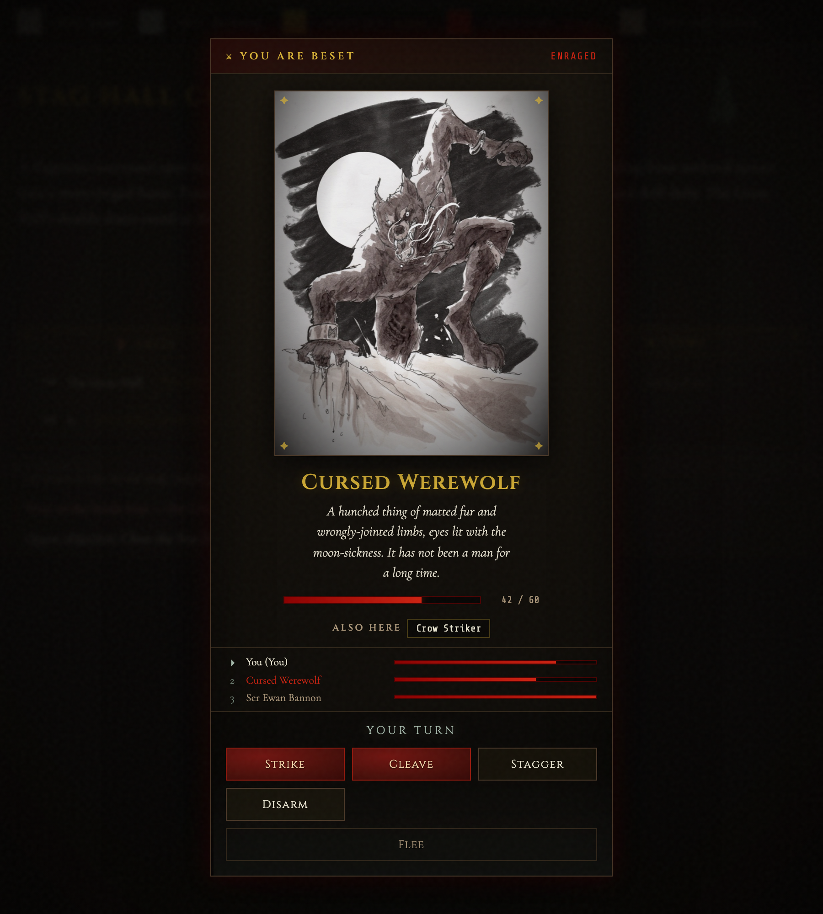
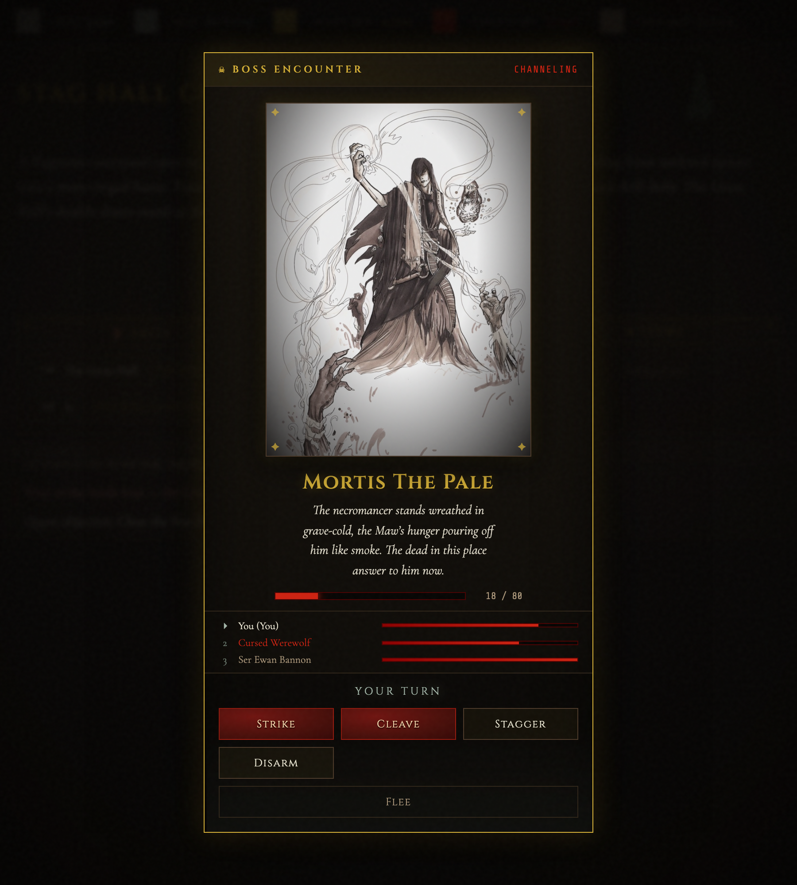
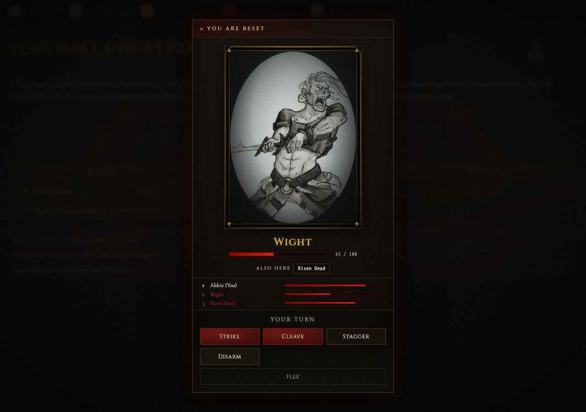

# Graphical Combat Encounters — Design + Prototype

A graphical, old-school dungeon-crawler combat surface for the EldritchMUSH
web client: you stand and face a **framed antagonist portrait** (the
dominant element on screen) with the foe's name as a gold title, HP as a
blood bar, a turn-order rail, a mist turn-indicator, and attack buttons.
Styled entirely in the existing **Mistbound Gothic** design system.

| Standard encounter | Boss encounter |
| --- | --- |
|  |  |

> Screenshots captured from `/preview.html?combat=1` and
> `?combat=1&boss=1` (vite dev + playwright). Portraits are real
> committed Eldritch assets — see provenance below.

---

## 1. Design rationale

The old combat UI was two text pieces: `CombatEncounterModal` (a "do you
want to engage?" yes/no prompt) and `CombatTracker` (a turn-order list).
Neither gives the player a *thing to face*. Classic graphical MUDs and
dungeon crawlers (Eye of the Beholder, the old graphical Diku front-ends)
put a single antagonist portrait front-and-centre — you are looking *at*
the monster, and the fight happens around that image. That's the feel
this panel delivers, without becoming cartoonish.

### How it honours Mistbound Gothic

- **Portrait is dominant, framed, atmospheric.** ~76% of the panel width,
  3:4 aspect, dark plate frame with an inner gold hairline, four gold
  corner `✦` marks (the wax-stamp / framed-plate motif from `.panel-decorated`),
  and a radial **vignette** so the portrait reads as *emerging from the
  gloom* rather than a clean profile photo.
- **Gold for the title + interactives only.** The foe's name is a Cinzel
  gold title (`--accent-gold`); action buttons are the interactive gold/
  blood language. No gold on body prose.
- **Prose = bone serif.** The flavour `desc` line under the name is
  italic Cormorant Garamond in `--bone`.
- **Danger = blood.** HP is a blood bar (`--accent-blood → --blood-bright`),
  pulsing (`pulse-blood`) when ≤30%. Attack buttons use the pressed-wax-
  seal blood gradient lifted straight from the quest-offer ACCEPT button.
- **The living / signals = mist.** The "YOUR TURN" banner and the current-
  turn arrow glow in `--mist` verdigris. The one ambient motion is a
  `mist-drift` haze at the arena's lower edge — the design system's single
  allowed animation; everything else holds still.
- **Mono only for system echo.** `--font-mono` appears only on the HP
  numerals and the status word, never on prose.
- **No CRT/scanlines.** Honoured.
- **Boss variant** swaps the frame/border to gold with a soft gold bloom
  and changes the eyebrow to `☠ BOSS ENCOUNTER`.
- **Accessibility:** all motion (mist drift, frame hit-pulse, low-HP
  pulse) is disabled under `prefers-reduced-motion`.

### Micro-feedback

The portrait frame **remounts keyed by HP changes** (`key={hitFlash}`),
firing a short red `cep-frame-hit` pulse each time the antagonist takes
damage — a graphical echo of the existing `damage-flash` screen flash,
but localized to the foe. At HP ≤ 0 the portrait desaturates/darkens and
a blood `SLAIN` plate drops over it; actions disable.

---

## 2. How NPC art keys map to portraits

NPCs (`eldritchmush/typeclasses/npc.py`) currently carry `key`, `desc`,
and aggression flags but **no art reference**. The plan adds one optional
attribute:

```python
# typeclasses/npc.py — at_object_creation (or per-NPC prototype)
self.db.art_key = "werewolf"   # creature/archetype label, optional
```

The frontend resolves it through `ART_BY_KEY` in `CombatEncounterPanel.jsx`,
which maps labels to **committed** asset paths:

```js
export const ART_BY_KEY = {
  werewolf:     '/landing/werewolf.jpg',
  necromancer:  '/landing/necromancer.jpg',
  nethermancer: '/landing/nethermancer.jpg',
  fae:          '/landing/fae.jpg',
  default:      '/art/skull.png',   // "unknown horror" fallback
}
```

Resolution order in `resolvePortrait()`:

1. `encounter.portrait` — an explicit path (server can send one directly).
2. `encounter.artKey` → `ART_BY_KEY[artKey]`.
3. `ART_BY_KEY.default` (the skull plate) — so an NPC with no art still
   gets a framed, on-theme portrait rather than a broken image.

**Why a key indirection rather than raw paths from the server?** It keeps
the art-provenance rule enforceable in *one* place on the client: the only
images the panel can ever show are the ones whitelisted in `ART_BY_KEY`
(plus an explicit `portrait` for staff-authored encounters). As new
committed creature art lands under `public/landing/**` or `public/art/**`,
you extend the map; the server only ever sends a label.

### Art provenance (HARD CONSTRAINT — satisfied)

Every image referenced is from the committed Eldritch art repository:

| Asset | Path | Used as |
| --- | --- | --- |
| `werewolf.jpg` (689×900) | `frontend/public/landing/werewolf.jpg` | standard-encounter portrait |
| `necromancer.jpg` (654×900) | `frontend/public/landing/necromancer.jpg` | boss portrait |
| `nethermancer.jpg`, `fae.jpg` | `frontend/public/landing/` | additional `ART_BY_KEY` entries |
| `skull.png` | `frontend/public/art/skull.png` | `default` fallback |

No AI-generated, external, or stock art is referenced. The provenance
rule is also restated as a comment block at the top of the component.

---

## 3. Integration plan (into the live CombatEncounterModal path)

The current flow: server fires an OOB encounter event → React opens
`CombatEncounterModal` → player clicks *Engage* → `strike <npc>` is sent →
`CombatTracker` shows turn/HP state from subsequent OOB combat events.

`CombatEncounterPanel` **replaces the sustained combat presentation**; the
existing modal can stay as the optional pre-fight "you may flee" prompt, or
be folded in as the panel's opening state. Recommended wiring:

1. **Server side (`typeclasses/npc.py`, `world/combat_loop.py`).**
   - Add `db.art_key` to NPC prototypes / `at_object_creation`.
   - When combat starts, send an OOB `combat_encounter` event carrying the
     antagonist: `{ name, desc, art_key, is_boss, hp, max_hp }`. The boss
     flag can be derived from an existing "boss"/tier attribute.
   - Per-turn, the existing combat OOB events already drive
     `CombatTracker`; reshape that same `combatTurnOrder` / `combatantHp`
     state into the panel's `turnOrder` array and update `encounter.hp` /
     `myTurn`. No new server data is needed beyond the antagonist packet.

2. **Client side (`App.jsx`).**
   - Replace the `CombatTracker` mount (and optionally the
     `CombatEncounterModal` mount) with `CombatEncounterPanel` while
     `oobState.inCombat` is true.
   - Map existing OOB state → props:
     - `encounter.hp/maxHp` ← `combatantHp[antagonistName]`
     - `encounter.myTurn` ← `oobState.myTurn`
     - `turnOrder` ← `combatTurnOrder.map(...)` flagging `isMe` /
       `isAntagonist`
     - `also` ← other hostiles in the room
   - `onAction(key)` → `sendCommand(\`${key} ${antagonist}\`)` (reuses the
     existing `strike`/`cleave`/`stagger`/`disarm` commands verbatim).
   - `onFlee()` → `sendCommand('disengage')`.
   - `onTargetOther(name)` → switch the focused antagonist (re-aim the
     panel) and `sendCommand(\`strike ${name}\`)`.

3. **Actions list** is data-driven (`actions` prop), so it can be gated by
   the player's skills server-side (e.g. only show `cleave` if
   `db.cleave > 0`) by sending an allowed-actions array in the encounter
   packet. The prototype ships a sensible default set.

Because every action button maps 1:1 to an existing text command, the
panel is **purely presentational** — it introduces no new combat rules and
can ship behind a feature flag with the text path as fallback.

---

## 4. Files

| File | Change |
| --- | --- |
| `frontend/src/components/CombatEncounterPanel.jsx` | **new** — the panel component + `ART_BY_KEY` map |
| `frontend/src/components/CombatEncounterPanel.css` | **new** — Mistbound-Gothic styling |
| `frontend/src/preview/main-preview.jsx` | wired `?combat=1` (+ `&boss=1`) with committed-asset fixtures |
| `docs/combat-encounter-graphical.md` | this writeup |
| `docs/img/combat-encounter-{normal,boss}.png` | reference screenshots |

### Previewing

```bash
cd frontend && npx vite        # then open:
#   http://localhost:<port>/preview.html?combat=1        (werewolf)
#   http://localhost:<port>/preview.html?combat=1&boss=1 (necromancer, boss frame)
```

If `frontend/node_modules` is absent in a worktree, symlink the main
repo's: `ln -s ../../frontend/node_modules ./node_modules` (adjust depth),
then run vite as above.

---

## 5. SHIPPED — sustained live face-off

The follow-up from §3 is now wired: the panel **persists through the whole
fight** with live HP and turn order, instead of dismissing on engage and
handing off to the text loop.



> `/preview.html?combat=live` — a mid-fight mock `oobState` (Aldric vs a
> Wight + Risen Dead) fed through the real `CombatEncounterHost`, so the
> screenshot exercises the actual prompt→live mapping.

### Where the state comes from

`CombatEncounterHost` now takes the whole `oobState` and a `useMemo`
derives the panel's `encounter` from it, in two modes:

- **Prompt mode** — `combat_encounter_prompt` fired but `inCombat` is
  false. Shows the opt-in walk-in face-off (engage or hold back).
- **Live mode** — `inCombat` is true. The same mounted panel reflects:
  - antagonist HP ← `combatantHp[primaryFoe]` (0..100 percentage from the
    OOB reducer's `combat_start` / `combat_hit` handlers),
  - the full `combatTurnOrder` rendered as the turn-order rail, each row
    carrying `combatantHp[name]`, `isMe` (`name === characterName`) and
    `isAntagonist`,
  - `myTurn` gating the action buttons (disabled when it isn't your turn),
  - SLAIN / zeroed bars when a foe's HP hits 0,
  - `combat_end` (`inCombat` → false) clears the derived encounter and the
    panel unmounts cleanly.

**Fields used:** `inCombat`, `combatTurnOrder` (`[name,…]`),
`combatantHp` (`{name: 0..100}`), `myTurn`, `characterName`, and the
remembered `combatEncounter.hostiles` (for portrait `artKey` / `desc` /
`isBoss`, since the turn order only carries bare names).

### Transitions

- **Engage** — an action button in prompt mode sends `strike <foe>`; the
  server's `combat_start` flips `inCombat` true and the *same* panel
  transitions to live mode (no remount).
- **Flee** — live mode sends `disengage`; prompt mode just holds back.
- **End** — `combat_end` resets combat state → `encounter` becomes null →
  panel dismisses.

### Antagonist identity

The turn order is bare names. The player is `characterName`; every other
name is a foe. The first foe in the order drives the portrait, enriched
with `artKey` / `desc` / `isBoss` by matching its name against the
remembered walk-in `hostiles`. Remaining foes appear as "ALSO HERE" chips.

### CombatTracker

`CombatEncounterPanel` is a full-screen fixed overlay (`z-index 1120`), so
the old inline `CombatTracker` would sit *behind* it during combat and is
now redundant on-screen. Its mount was removed from `App.jsx` (and the
unused import dropped). The `CombatTracker.{jsx,css}` files are kept in the
tree (no other importers; harmless) rather than deleted.

### Files touched (this change)

| File | Change |
| --- | --- |
| `frontend/src/components/CombatEncounterHost.jsx` | rewritten — owns prompt+live modes, derives `encounter` via `useMemo` over `oobState` |
| `frontend/src/App.jsx` | pass `oobState` to the host; remove inline `CombatTracker` mount + import |
| `frontend/src/preview/main-preview.jsx` | added `?combat=live` fixture driven through the real host |
| `docs/img/combat-live-faceoff.png` | live-mode screenshot |
